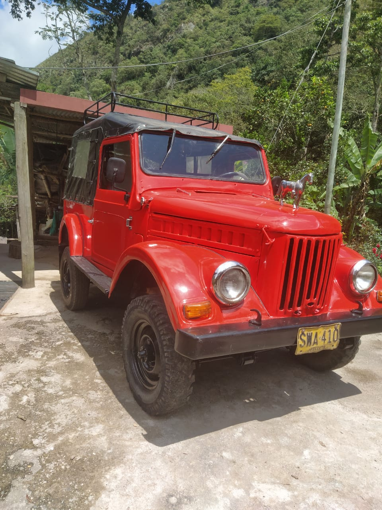

# ARO M - 461

<table>
  <tr>
    <td>
      
    </td>
    <td>
      El campero ARO M - 461, fue construido por la empresa rumana "Auto Romania", conocida como ARO, a partir del diseño del GAZ 69 (IMS 57) razón por la cual tiene un aspecto "rústico" de vehículo militar de la segunda guerra mundial. El M-461 fue exportado a páises como China y Colombia. En Colombia se conoce como ARO Carpati y en otros países como IMS ARO M-461.

El nombre del modelo,  M-461, surgió como un código constituido por la M que indicaba la ubicación de la fábrica en Câmpulung Muscel, 4 porque era el cuarto prototipo, y 61 por el año en que se inició el proyecto.

    </td>
  </tr>
</table>

## Colombia

Las exportaciones empezaron en 1965 con 2.000 unidades.

## References

- [ARO M 461](https://www.autoevolution.com/cars/aro-m-461-1963.html#aeng_aro-muscel-m-461-1963-25)
- [Página del club de ARO M-461](https://www.aro-m461.cz/)

